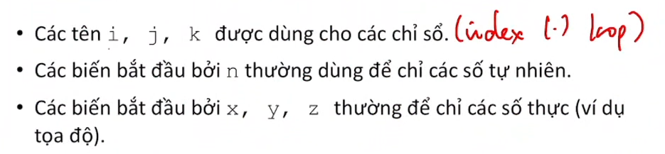

# Chương 5 Phong cách lập trình

## 1. Khái niệm phong cách lập trình

readability

dễ đọc, dễ hiểu, dễ bảo trì, nâng cấp

## 2. một số quy tắc cơ bản về phong cách lập trình

định dạng
đặt tên
đặc tả hàm
chú thích

priorities: độ ưu tiên

tên hàm bắt đầu bằng to be -> bool
ví dụ: `bool isNumber(int n);`

## 3. viết tài liệu chương trình
