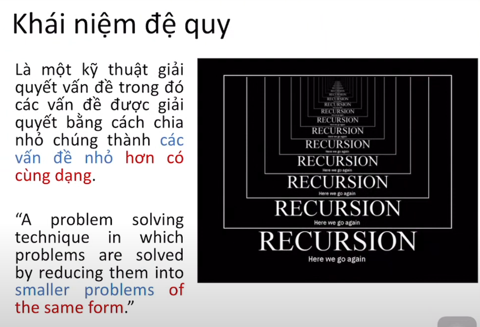
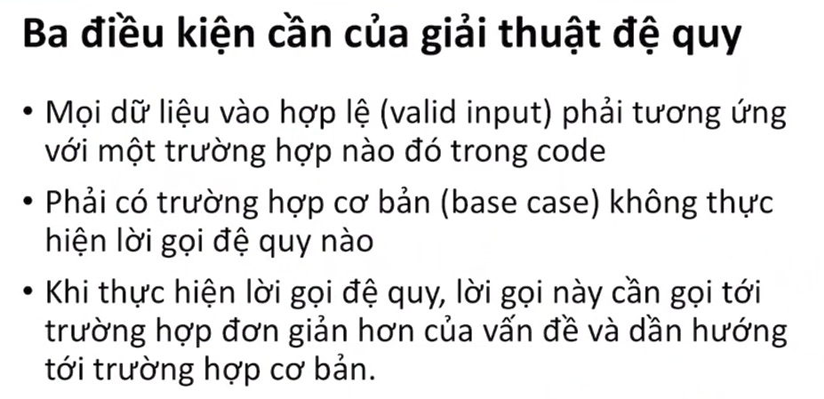
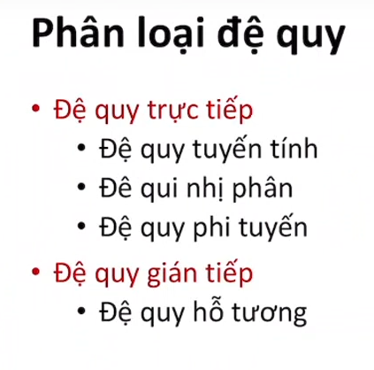
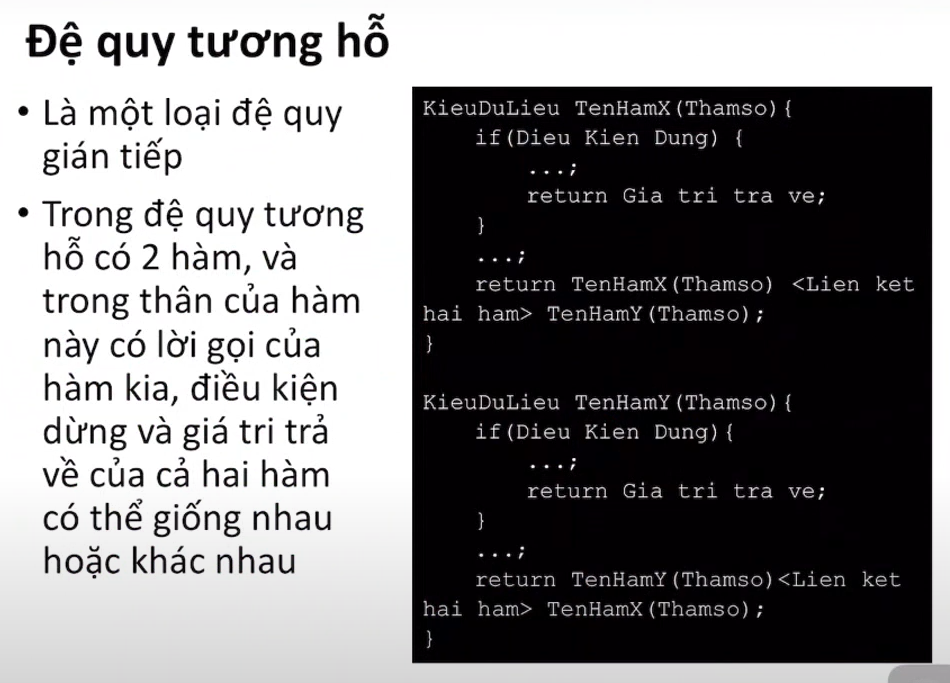
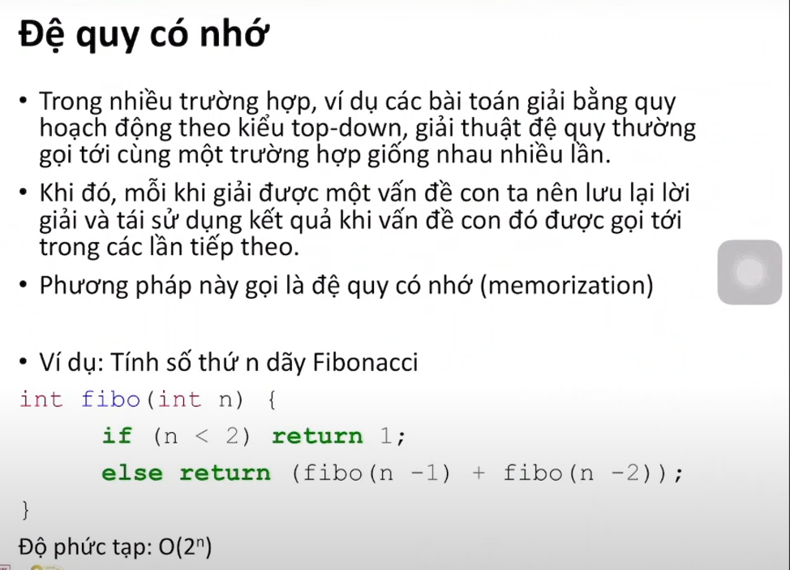
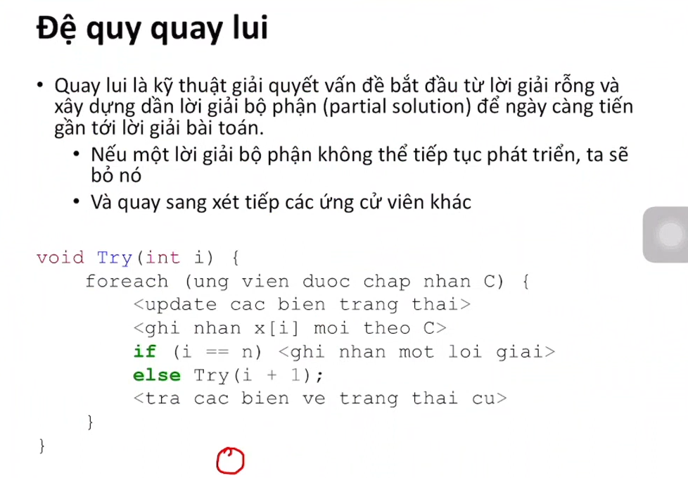
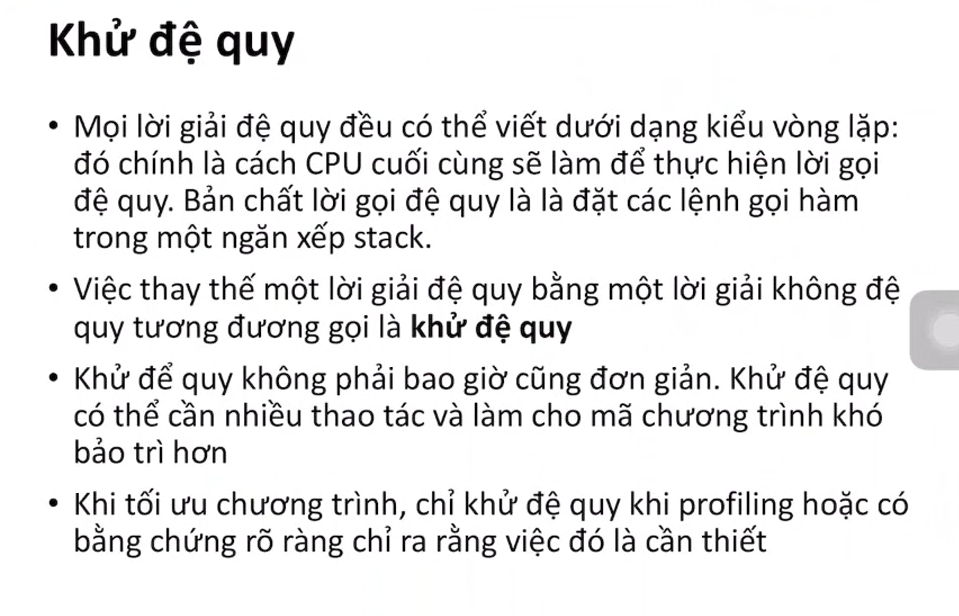

# Chương 6 - Đệ quy và khử đệ quy

## 1. Nhắc lại kn đệ quy

## 2. Phân loại đệ quy

đệ quy tuyến tính là dạng đệ quy cơ bản nhất chỉ có 1 th gọi đệ quy với 1 là th suy biến, 2 là th cơ bản - gọi đệ quy

đệ quy nhị phân có 2 th gọi đệ quy

đệ quy phi tuyến là đệ quy mà lời gọi đệ quy được thực hiện trong vòng lặp

## 3. Đệ quy có nhớ và đệ quy quay lui

đệ quy có nhớ
lưu lại lời giải

đệ quy quay lui

## 4. Khử đệ quy

không dùng đệ quy

