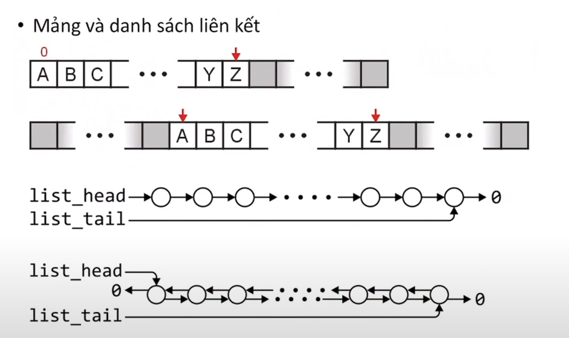
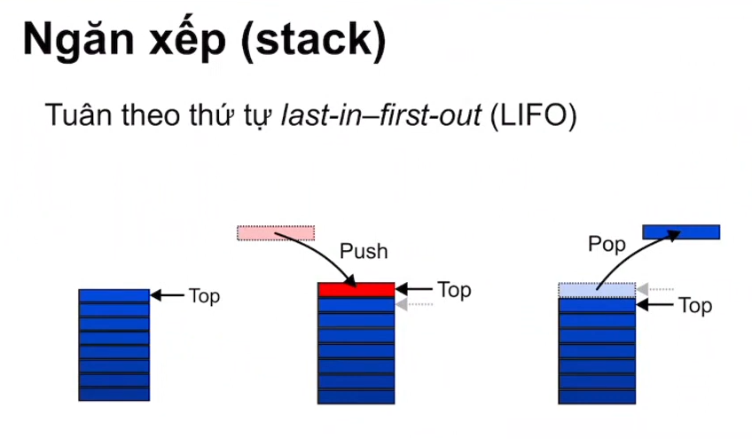
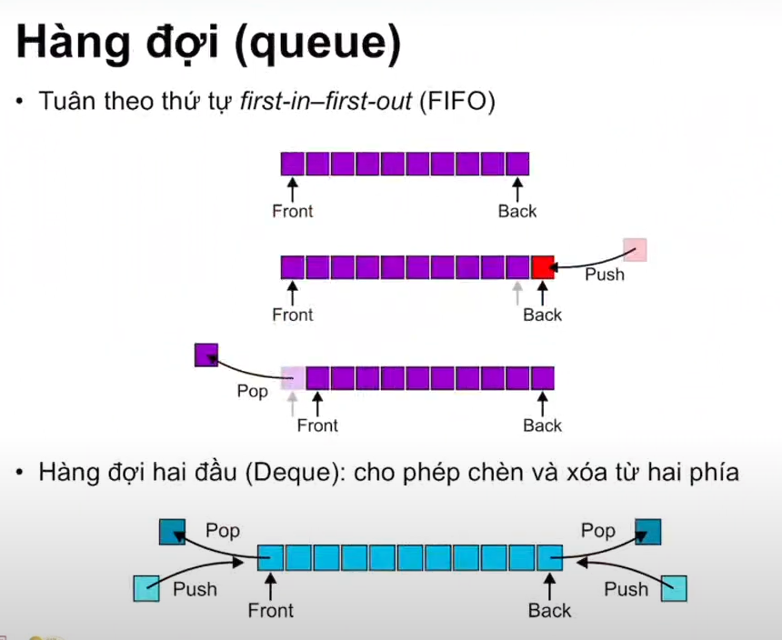
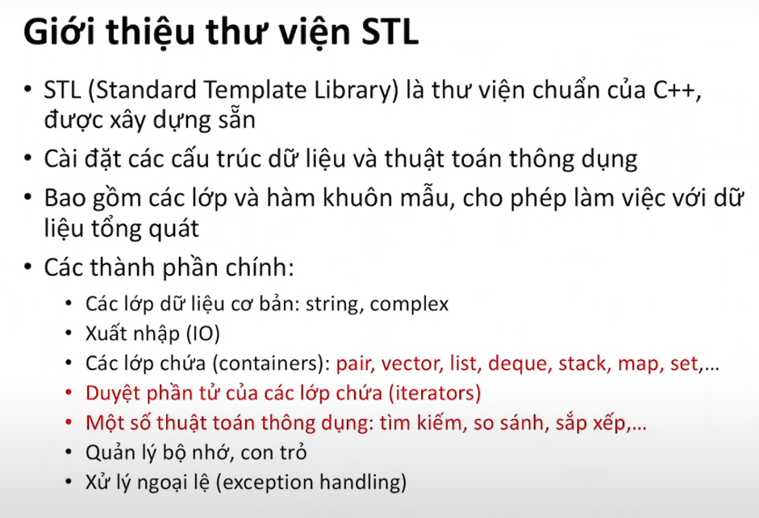
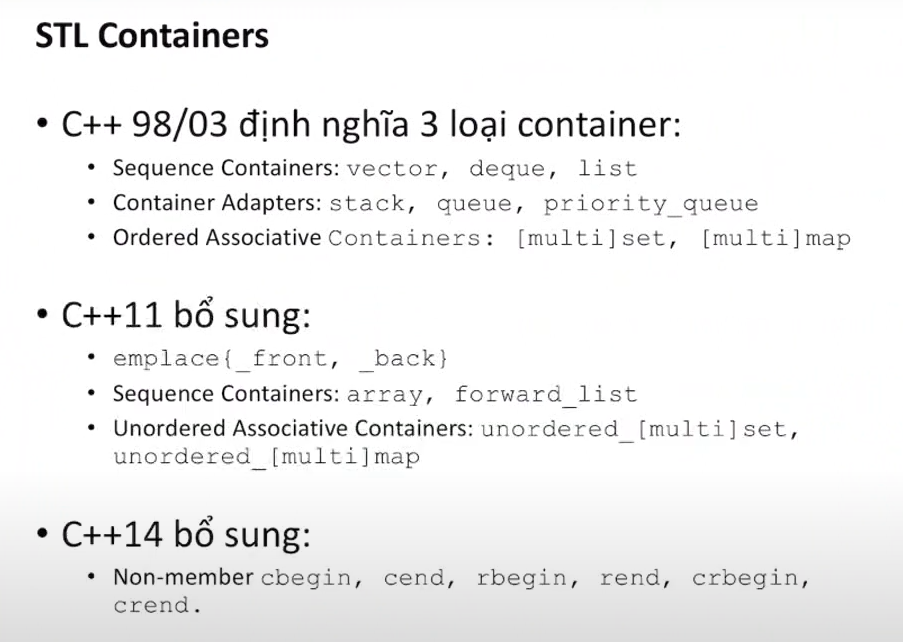
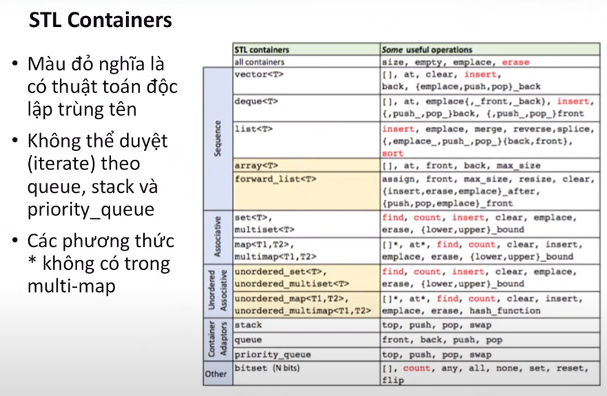
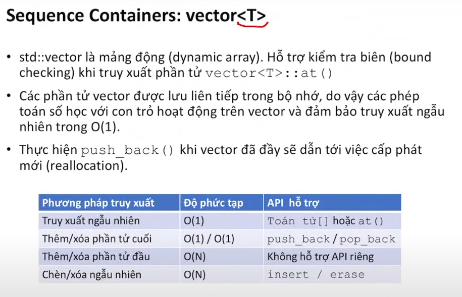
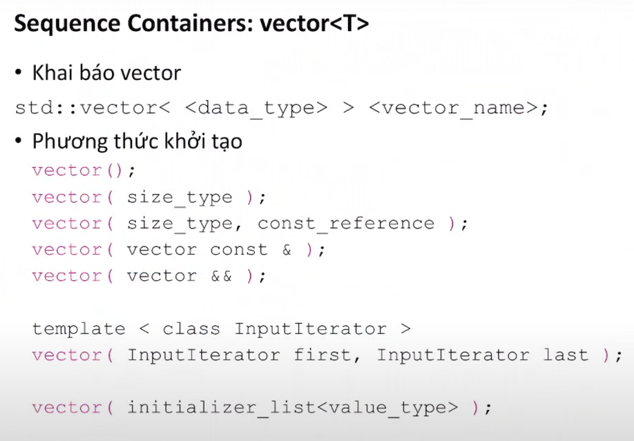
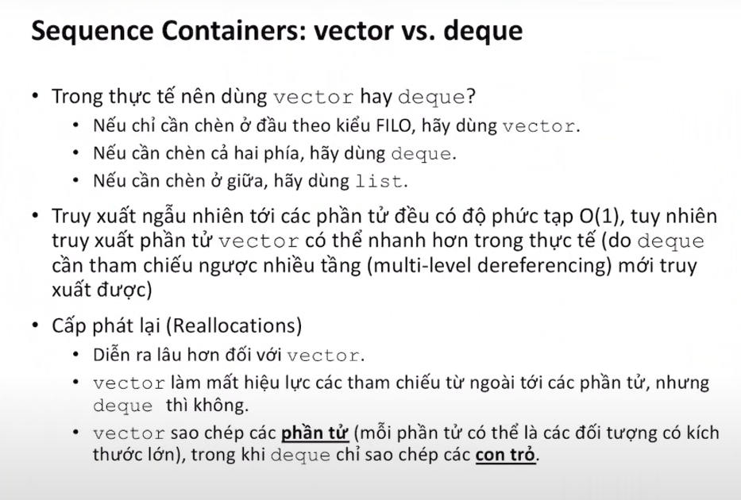
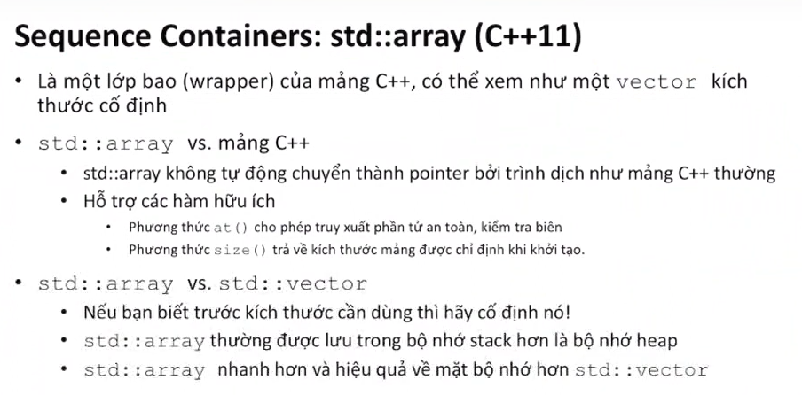

# Chương 7 Ứng dụng các cấu trúc dữ liệu cơ bản

## 1. Nhắc lại các cấu trúc dữ liệu cơ bản

mảng và danh sách liên kết

mảng 1, 2 chiều
dslk đơn, đôi

ngăn xếp (stack) - last-in-first-out (LIFO)

hàng đợi (queue) - first-in-first-out (FIFO)

hàng đợi 2 đầu (deque)

## 2. Giới thiệu thư viên STL và cách sử dụng các cấu trúc cơ bản

STL container

vector

so sánh

kiểu dữ liệu array (kích thước cố định)

## 3. Một số ví dụ ứng dụng
