# Chương 9 Gỡ lỗi, kiểm thử và tinh chỉnh mã nguồn

## 1. Gỡ lỗi

### 1.1 Khái niệm

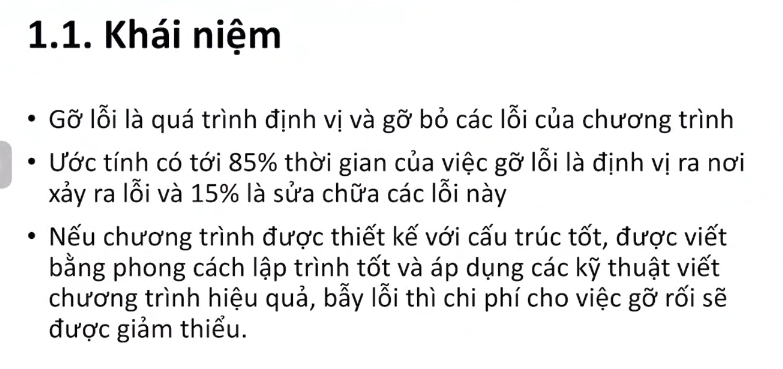

### 1.2 Phân loại lỗi

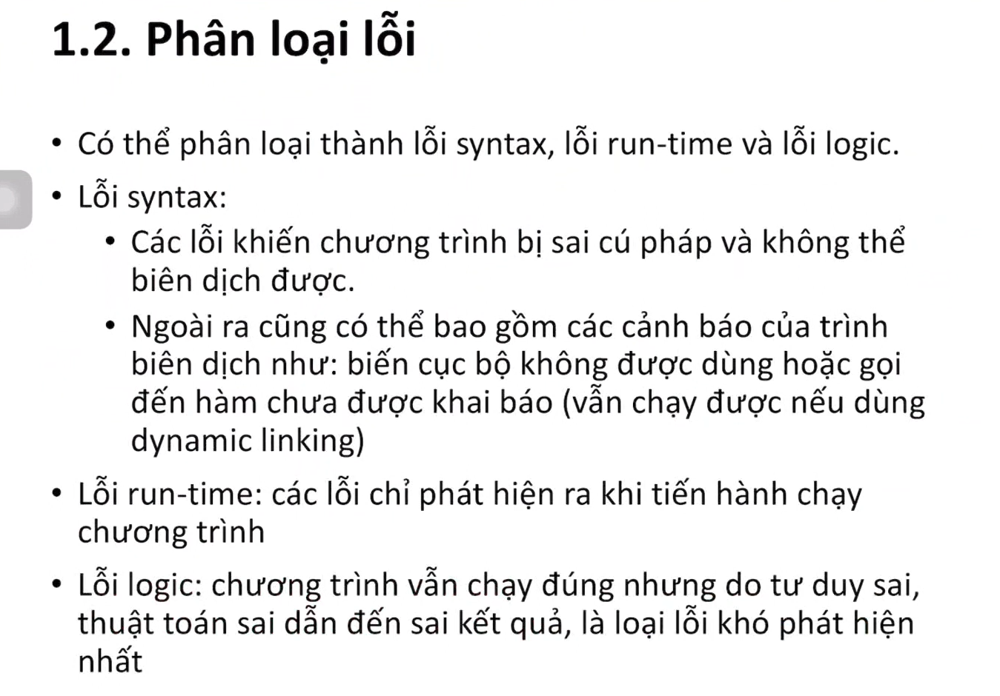

### 1.3 Quy trình gỡ lỗi

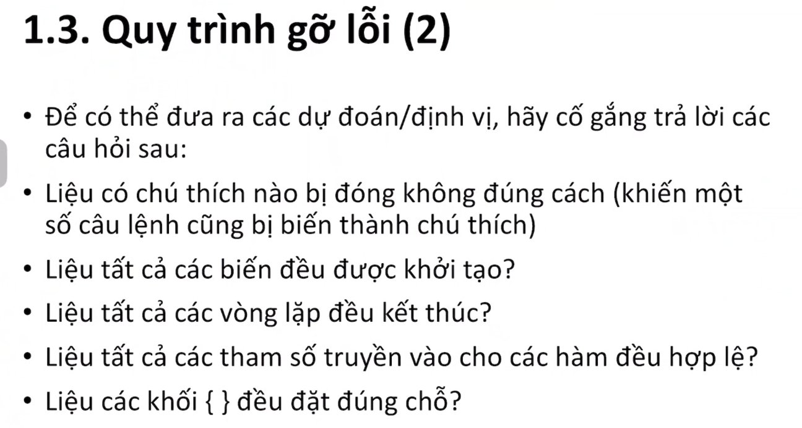

### 1.4 Lời khuyên khi gỡ lỗi

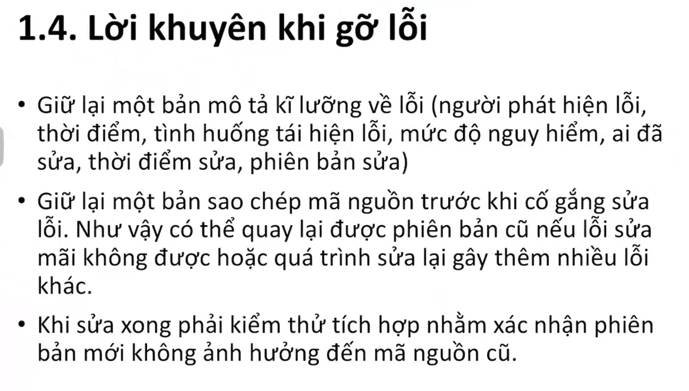
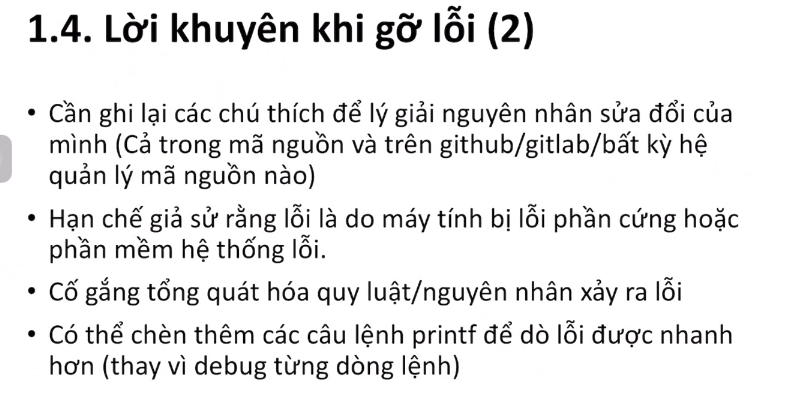

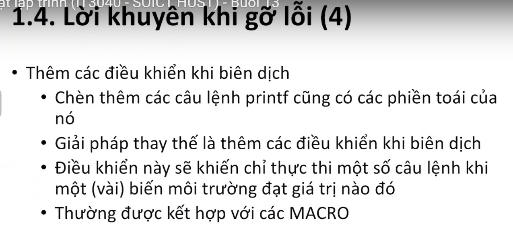
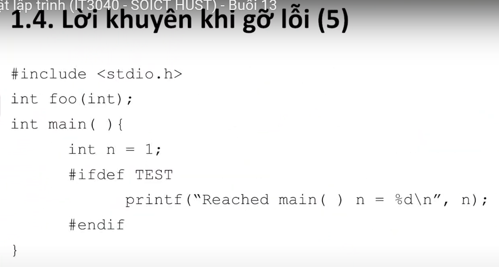
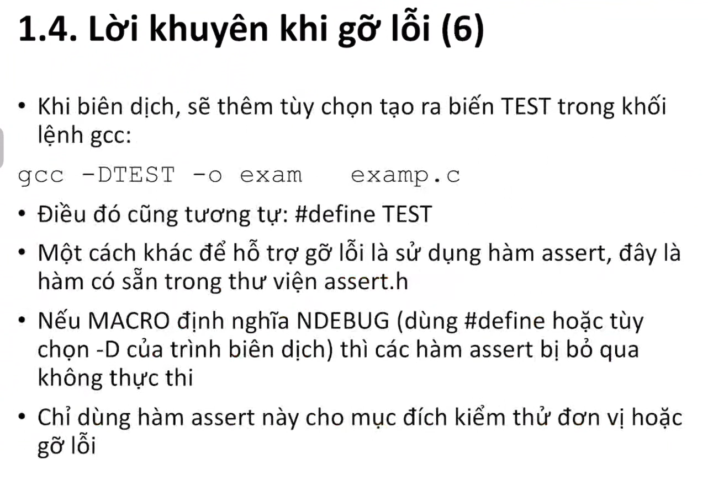
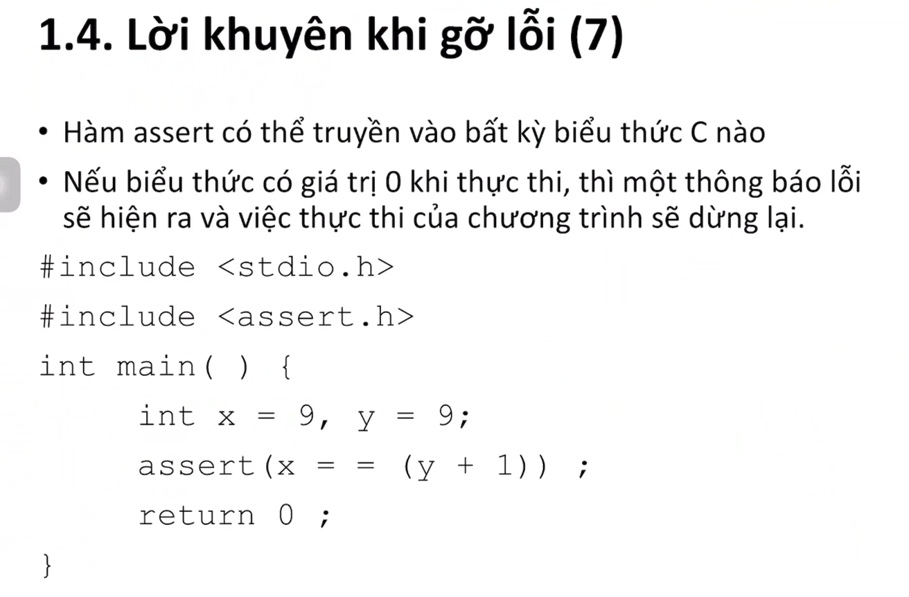

### 1.5 Gdb

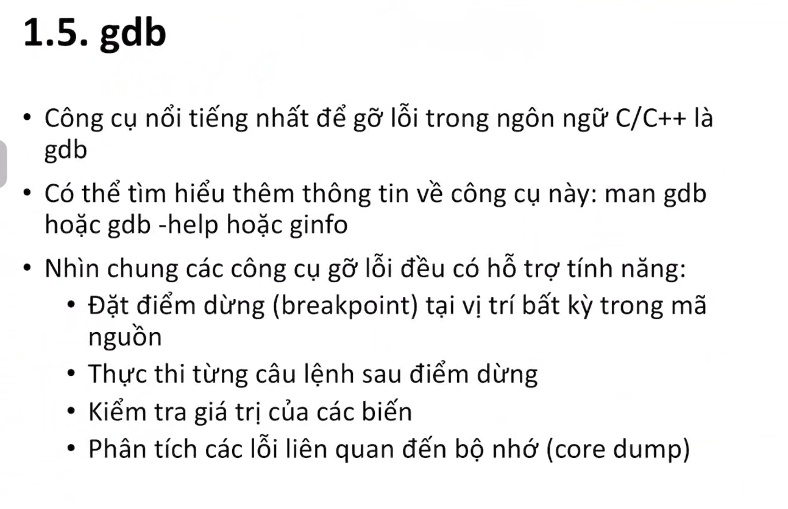

## 2. Kiểm thử

### 2.1 Khái niệm

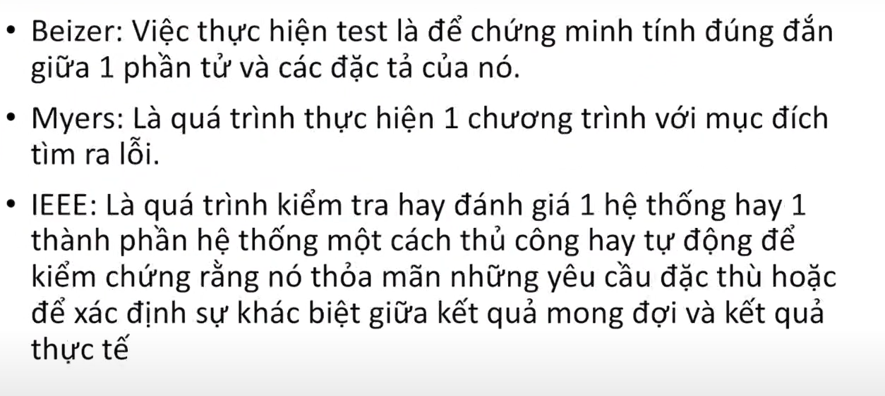

### 2.2 Phương pháp kiểm thử

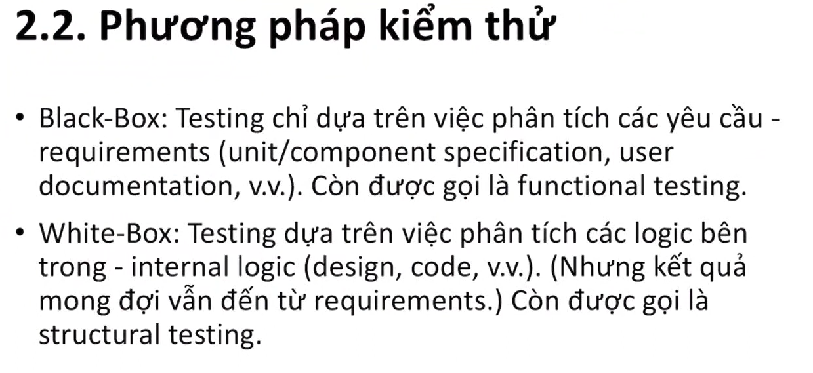
hộp đen - kiểm thử hành vi: không biết cấu trúc bên trong của chương trình mà chỉ dựa vào đặc tả, yêu cầu của hệ thống chương trình mà thiết kế các test case đáp ứng đúng yêu cầu, đặc tả đó

hộp trắng - kiểm thử cấu trúc: kiểm chứng, phân tích mã nguồn, tiêu chí bao phủ mã nguồn
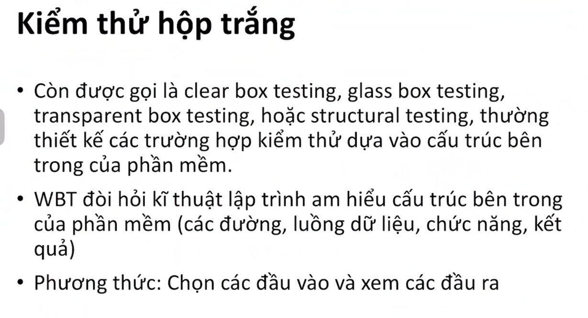

mức độ kiểm thử
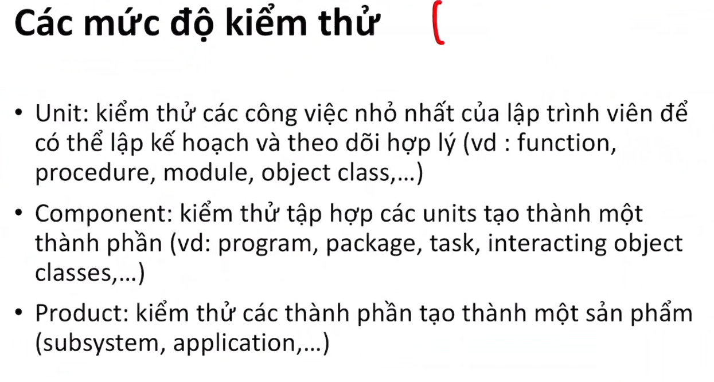
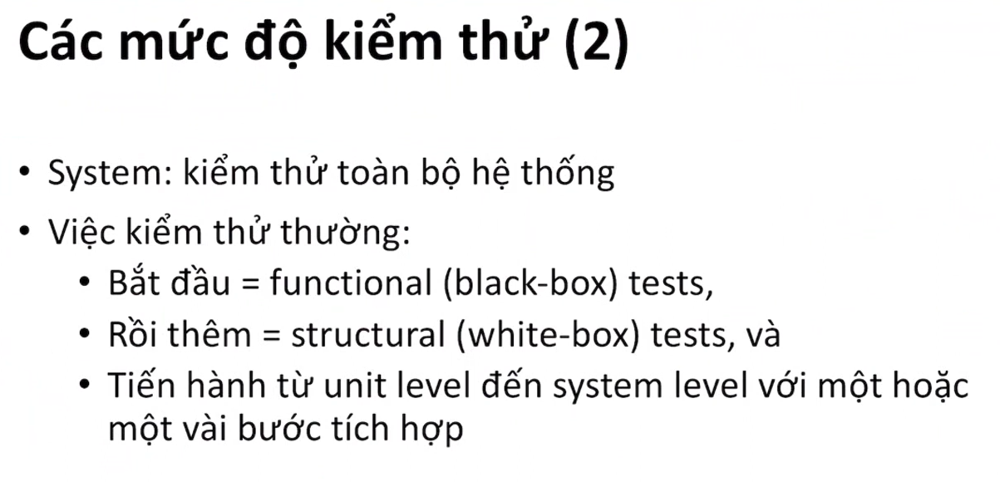

### 2.3 Độ bao phủ kiểm thử

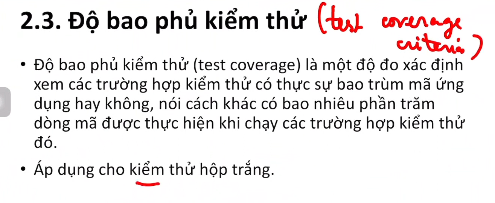

### 2.4 Các phương pháp đo

## 3. Tinh chỉnh mã nguồn

### 3.1 Hiệu năng

### 3.2 Các phương pháp

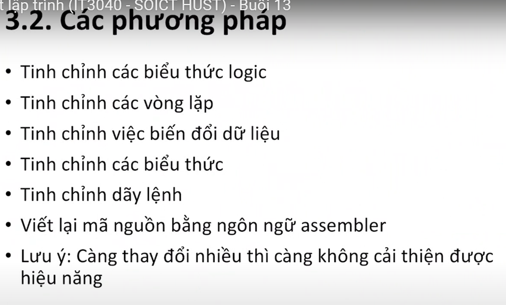

### 3.3 Kết luận
